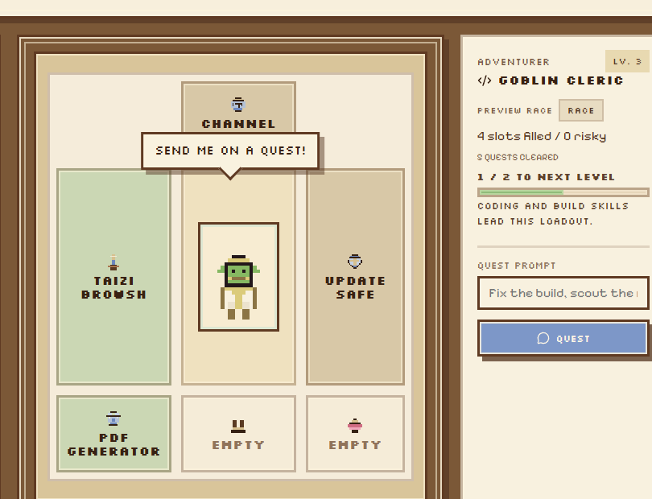

<p align="center">
  
</p>

<p align="center">
  <a href="https://github.com/sandrokitchener/ClawQuest/actions/workflows/ci.yml?branch=main"></a>
  <a href="https://discord.gg/clawd"></a>
  <a href="LICENSE"></a>
</p>

<p align="center"><em>Send adventurers on quests with magical equipment called skills. Claw Quest is a playful desktop companion for OpenClaw, where your agent becomes a little pixel hero, your tools become enchanted gear, and each prompt becomes a call to adventure.</em></p>

<p align="center">
  <a href="desktop/README.md">Desktop Setup</a> |
  <a href="#claw-quest-desktop-app">Claw Quest</a> |
  <a href="#clawhub-registry">ClawHub Registry</a> |
  <a href="docs/README.md">Docs</a> |
  <a href="CONTRIBUTING.md">Contributing</a> |
  <a href="https://discord.gg/clawd">Discord</a>
</p>

## Claw Quest desktop app

This repo includes **Claw Quest**, a Bun + React + Vite + Tauri desktop manager for OpenClaw skills.

It gives you:

- a drag-and-drop skill market
- an RPG-style equipment and loadout screen for installed skills
- local install and removal management
- quest sending through a local build, remote gateway, or Docker container

Quick start from the repo root:

```bash
bun install
bun run desktop:dev
# or
bun run desktop:build
```

Desktop builds require Rust in addition to Bun.

Full setup notes live in [`desktop/README.md`](desktop/README.md), including local, remote gateway, and Docker connection guidance.

### Screenshots




### Source control and releases

Best practice is to push the **source** for Claw Quest and leave compiled output out of git:

- commit source, docs, icons, config, and lockfiles
- do not commit `desktop/src-tauri/target/`, packaged installers, or built `.exe` files
- publish installers and executables through GitHub Releases, itch.io, or another download host
- keep the README focused on setup and build steps so anyone can recreate a verified build from source

Desktop sound effects were made with [Bfxr](https://www.bfxr.net/).

### Coming soon

- support for other agent managers beyond OpenClaw
- integration experiments for `RustClaw`, `TinyClaw`, and `ZeroClaw`
- a broader cross-manager skill armory so Claw Quest can grow into a shared fantasy control panel for different claw stacks

## ClawHub registry

ClawHub is the **public skill registry for Clawdbot**: publish, version, and search text-based agent skills (a `SKILL.md` plus supporting files). It is designed for fast browsing, a CLI-friendly API, moderation hooks, and vector search.

onlycrabs.ai is the **SOUL.md registry**: publish and share system lore the same way you publish skills.

## What you can do with it

- browse skills and render their `SKILL.md`
- publish new skill versions with changelogs and tags
- rename or merge owned skills without breaking installs
- browse and publish souls with `SOUL.md`
- search with embeddings instead of brittle keyword matching
- star and comment, with moderation and approval tools for admins and moderators

## How it works

- web app: TanStack Start (React, Vite/Nitro)
- backend: Convex + Convex Auth
- search: OpenAI embeddings (`text-embedding-3-small`) + Convex vector search
- API schema and routes: `packages/schema`

## CLI

Common CLI flows:

- auth: `clawhub login`, `clawhub whoami`
- discover: `clawhub search ...`, `clawhub explore`
- manage local installs: `clawhub install <slug>`, `clawhub uninstall <slug>`, `clawhub list`, `clawhub update --all`
- inspect without installing: `clawhub inspect <slug>`
- publish and sync: `clawhub publish <path>`, `clawhub sync`
- canonicalize owned skills: `clawhub skill rename <slug> <new-slug>`, `clawhub skill merge <source> <target>`

Docs: [`docs/quickstart.md`](docs/quickstart.md), [`docs/cli.md`](docs/cli.md).

## Local dev

Prereqs: [Bun](https://bun.sh/).

```bash
bun install
cp .env.local.example .env.local
# edit .env.local

# terminal A
bunx convex dev

# terminal B
bun run dev
```

For full setup instructions, see [CONTRIBUTING.md](CONTRIBUTING.md).

## Docs

- [`docs/README.md`](docs/README.md)
- [`docs/spec.md`](docs/spec.md)
- [`desktop/README.md`](desktop/README.md)
