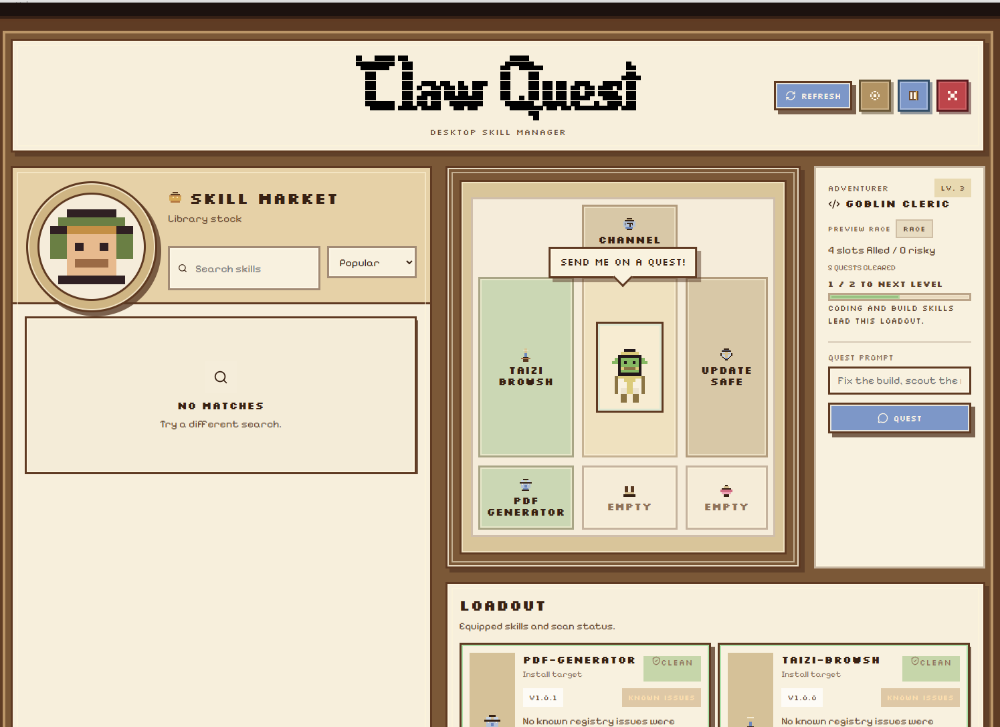

<p align="center">
  
</p>

<p align="center">
  <a href="https://github.com/sandrokitchener/ClawQuest/actions/workflows/ci.yml"></a>
  <a href="https://github.com/sandrokitchener/ClawQuest/blob/main/desktop/package.json"></a>
  <a href="https://github.com/sandrokitchener/ClawQuest/stargazers"></a>
  <a href="https://buymeacoffee.com/akitchener"></a>
  <a href="LICENSE"></a>
</p>

<p align="center"><em>Send adventurers on quests with magical equipment called skills. Claw Quest is an OpenClaw front end that turns skill management into a little RPG loadout screen instead of a pile of shell commands.</em></p>



## Desktop and mobile repo

Claw Quest is a Tauri-based OpenClaw companion with two current targets:

- Windows desktop builds with installer bundles
- Android mobile builds packaged as APKs

Both targets now live on `main` and share the same app source in [`desktop/`](desktop/). The GitHub release workflows are separated by tag:

- `desktop-v*` publishes Windows desktop installers
- `mobile-v*` publishes Android APK prereleases

The point is not to replace OpenClaw. The point is to sit beside it and make a few common tasks feel better:

- browse what is installed
- search the registry and install or remove skills
- see rough security state for installed skills
- send a prompt to your agent without leaving the app

## Current scope

Right now Claw Quest is aimed at people who already use OpenClaw and want a friendlier desktop or mobile shell around it. The app works best when the Gateway is already running and the OpenClaw workspace is reachable from the host machine. Local OpenClaw installs are the smoothest path, but the app can also be pointed at a remote Gateway or a Docker-based setup.

Skill install and remove are still host-filesystem operations, so Docker users should bind-mount the same workspace and skills directory that the app can see.

## Prerequisites

Before you try to build Claw Quest, you should have:

- [Bun](https://bun.sh/)
- a working Rust toolchain with Cargo
- the Windows build prerequisites needed by Tauri
- an OpenClaw setup the app can talk to, whether that is a local install, a reachable Gateway, or a Docker container with a shared workspace

## Quick start

From the repo root:

```bash
bun install
bun run desktop:dev
```

This launches the Tauri desktop app in development mode.

## Build targets

### Desktop

From the repo root:

```bash
bun run desktop:dev
bun run desktop:build
bun run desktop:check
```

- `desktop:dev` runs the Tauri desktop app in development mode
- `desktop:build` creates the Windows desktop bundles
- `desktop:check` runs the desktop TypeScript and Rust checks

If you only want the direct Windows executable without installer bundles:

```bash
cd desktop
bunx tauri build --no-bundle
```

The direct executable ends up at:

```text
desktop\src-tauri\target\release\claw-quest.exe
```

### Mobile (Android)

You will also need a working Android toolchain:

- Java 21
- Android SDK command-line tools
- Android platform `android-36`
- Android build-tools `36.1.0`
- Android NDK `27.2.12479018`

Then from the repo root:

```bash
cd desktop
bunx tauri android init --ci
bunx tauri android build --apk --target aarch64 --ci
```

The generated APK will be placed under the Android Gradle output tree inside `desktop/src-tauri/gen/android/`.

## Releases

GitHub Actions release builds are split by tag:

```bash
git tag desktop-vX.Y.Z
git push origin desktop-vX.Y.Z
```

```bash
git tag mobile-vX.Y.Z
git push origin mobile-vX.Y.Z
```

Useful extra desktop-only commands from the repo root:

```bash
bun run desktop:ui:dev
bun run desktop:ui:build
```

Desktop-specific setup and connection-mode notes live in [`desktop/README.md`](desktop/README.md).

## Build details

The README badges above are live repo signals:

- `Desktop CI` tracks the Windows GitHub Actions build for the Tauri app
- `Desktop Version` is pulled from `desktop/package.json`
- `GitHub Stars` shows how many people have starred the repo

The desktop executable path and the local build commands above are still the source of truth if you are building from source.

## Releases and source

The repo should contain the source, assets, docs, and lockfiles needed to recreate the app. Built `.exe`, `.msi`, installer bundles, and `desktop/src-tauri/target/` should stay out of git and be published through GitHub Releases or another download host instead.

## Attributions

Credits for bundled fonts, sound tools, and other third-party materials live in [`ATTRIBUTIONS.md`](ATTRIBUTIONS.md).

## Star History

[](https://www.star-history.com/#sandrokitchener/ClawQuest&type=Date)

## More docs

- [`desktop/README.md`](desktop/README.md)
- [`docs/README.md`](docs/README.md)
- [`docs/quickstart.md`](docs/quickstart.md)
- [`docs/cli.md`](docs/cli.md)
- [`CONTRIBUTING.md`](CONTRIBUTING.md)
