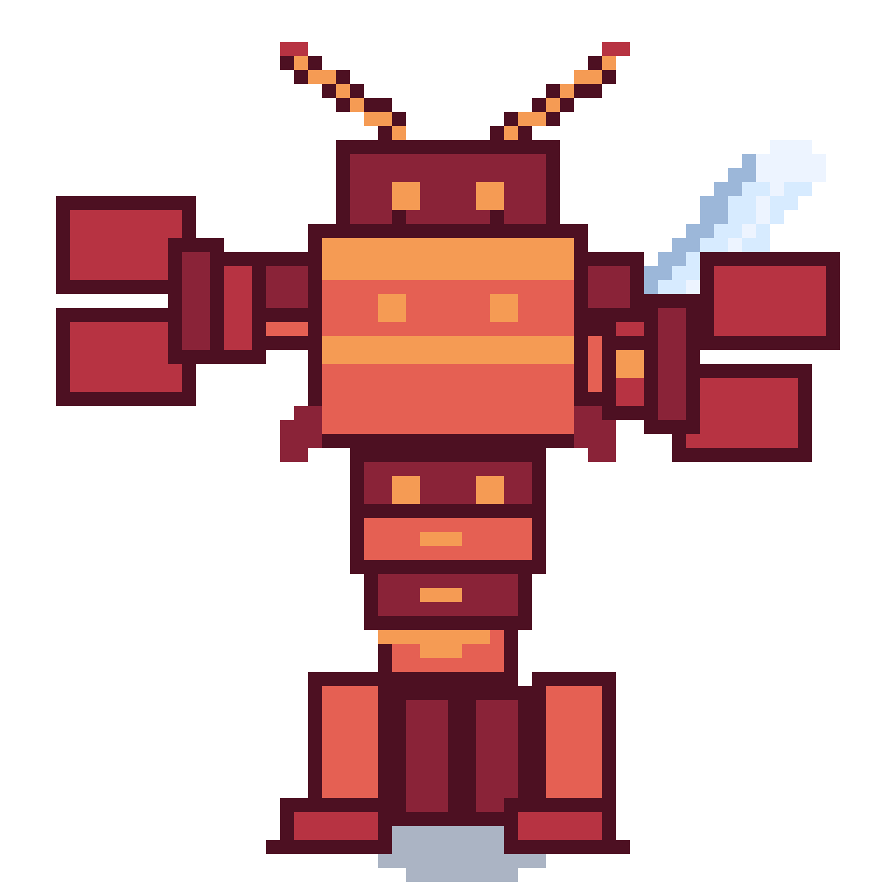

<p align="center">
  
</p>

<p align="center">
  
</p>

<p align="center">
  <a href="https://github.com/sandrokitchener/ClawQuest/actions/workflows/ci.yml"></a>
  <a href="https://github.com/sandrokitchener/ClawQuest/blob/main/desktop/package.json"></a>
  <a href="https://github.com/sandrokitchener/ClawQuest/stargazers"></a>
  <a href="https://buymeacoffee.com/akitchener"></a>
  <a href="LICENSE"></a>
</p>

<p align="center"><em>Claw Quest is an OpenClaw companion that turns skills into equipment, prompts into quests, and gateway setup into something that feels like an RPG instead of a terminal chore.</em></p>


## What it does

Claw Quest currently ships as:

- a Windows desktop Tauri app
- an Android companion app that talks to an OpenClaw Gateway

The current build focuses on a smoother OpenClaw experience:

- browse and equip skills from a merchant-style skill shop
- view your live loadout from the connected OpenClaw instance
- send quest prompts to your OpenClaw agent
- see quest progress and delayed follow-up completions on Android
- receive Android `Quest complete` notifications when the app is backgrounded
- connect from Android with manual gateway entry or demo mode
- customize speech bubbles and return flavor from JSON
- play a main theme plus a separate merchant theme when the shop opens

## Current highlights

- Android now supports remote Gateway pairing and live quest dispatch
- Android skill loadout reads from the connected OpenClaw host
- Mobile skill cards are optimized for a denser two-column shop layout
- The quest composer is multiline, and only the `Quest` button sends
- The `Quest in progress` panel is compact and keeps an elapsed timer
- Quest flavor text now comes from [`desktop/src/data/quest-voice-pack.json`](desktop/src/data/quest-voice-pack.json)

## Prerequisites

Before building Claw Quest, you should have:

- [Bun](https://bun.sh/)
- a working Rust toolchain with Cargo
- the Windows prerequisites required by Tauri
- an OpenClaw setup you can reach, either locally or through a Gateway

For Android builds you will also need:

- Java 21
- Android SDK command-line tools
- Android platform `android-36`
- Android build-tools `36.1.0`
- Android NDK `27.2.12479018`

## Quick start

From the repo root:

```bash
bun install
bun run desktop:dev
```

Useful repo-level commands:

```bash
bun run desktop:dev
bun run desktop:build
bun run desktop:check
bun run desktop:ui:dev
bun run desktop:ui:build
```

## Desktop builds

If you want the full desktop bundles:

```bash
bun run desktop:build
```

If you only want the Windows executable without installer bundles:

```bash
cd desktop
bunx tauri build --no-bundle
```

The executable ends up at:

```text
desktop\src-tauri\target\release\claw-quest.exe
```

## Android builds

Initialize the Android project once:

```bash
cd desktop
bunx tauri android init --ci
```

Then build an arm64 APK:

```bash
cd desktop
bunx tauri android build --apk --target aarch64 --ci
```

The APK is written under:

```text
desktop\src-tauri\gen\android\app\build\outputs\apk\arm64\release\
```

## Android setup flow

Claw Quest on Android should open on its own. A gateway is only needed when you actually want to connect or send quests.

The setup sheet currently offers:

- `Manual Setup`
- `Try Demo`

Recommended connection flow:

1. Install Claw Quest on the phone.
2. On the OpenClaw host, run the `clawquest-connect` helper flow.
3. Ask OpenClaw: `I want to connect ClawQuest`
4. In Claw Quest Android, choose `Manual Setup`
5. Paste the gateway URL and token or password the helper sent you
6. Let the helper approve the next `Claw Quest Android` pairing request once

Notes:

- `Manual Setup` is the primary connection path.
- `Try Demo` is useful for screenshots, first-run exploration, and reviewer-friendly installs.

## Connection model

Claw Quest does not replace OpenClaw. It sits beside it.

- Desktop is best when OpenClaw is installed locally and the workspace is reachable from the same machine.
- Android is designed around a reachable OpenClaw Gateway.
- Containerized OpenClaw can work well as long as the Gateway is reachable and any workspace or skills directory you care about is bind-mounted appropriately.

If you want mobile pairing to feel smooth, the intended path is:

- use the host-side helper to send the current gateway URL and token or password to your phone over WhatsApp
- paste those details into Claw Quest Android `Manual Setup`
- let the host approve the next Android pairing request once

## Flavor and customization

Speech bubbles, busy-state chatter, and quest-return flavor are data-driven.

You can edit:

- [`desktop/src/data/quest-voice-pack.json`](desktop/src/data/quest-voice-pack.json)

That file is meant to be a clean starting point for adding your own class, race, and quest-return variations.

## Releases

GitHub Actions release builds are tag-driven:

```bash
git tag desktop-vX.Y.Z
git push origin desktop-vX.Y.Z
```

```bash
git tag mobile-vX.Y.Z
git push origin mobile-vX.Y.Z
```

- `desktop-v*` publishes Windows installers
- `mobile-v*` publishes Android APK prereleases

Built artifacts should be distributed through GitHub Releases rather than committed into the repo.

## Attributions

Credits for bundled fonts, audio tools, and third-party materials live in [`ATTRIBUTIONS.md`](ATTRIBUTIONS.md).
